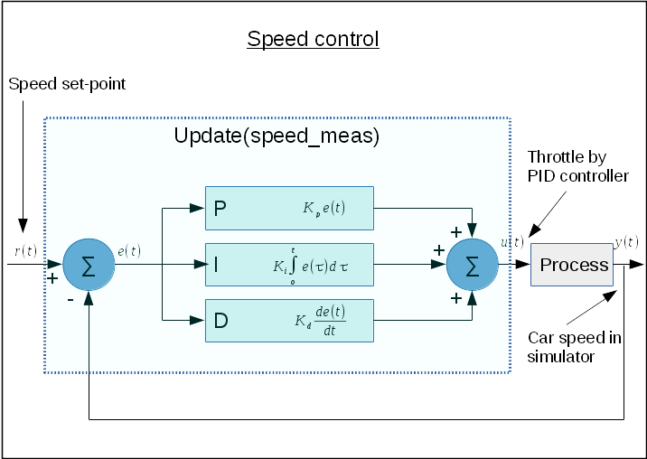

# CarND-Controls-PID
Self-Driving Car Engineer Nanodegree Program

---

## Introduction

This project is my PID-project submission in Self-Driving Car Engineerin Nanodegree Program.
Target of the project is to design a PID controller to control car steering angle.
Result is evaluated by attaching PID-controller to term2-simulator and simulating it. Simulator
reports information such as.
1. cte - cross-track-error
2. steering angle
3. speed
4. throttle

Here is how information is received in control loop
```
const double cte = std::stod(j[1]["cte"].get<std::string>());
const double speed = std::stod(j[1]["speed"].get<std::string>());
const double angle = std::stod(j[1]["steering_angle"].get<std::string>());
const double throttle = std::stod(j[1]["throttle"].get<std::string>());
```

From control loop we are sending following information back to simulator
1. Steering Angle
2. Throttle

From these values we are using **cte** as an error input to PID-controller. PID-controller is then
using this given error information to calculate new control variable which in our car simulator
is steering angle. Finally steering angle is sent back to simulator together with throttle. I have
set throttle to fixed value for simplicity.

### Steering Control

As simulator is already returning error value (cross-track error) we don't need to calculate it in PID controllor.
This leads us to use two specific functions `UpdateError()`and `TotalError()`. In main loop we are using these
functions in following way.
```
pid_steer.UpdateError(cte);
steer_value = pid_steer.TotalError();
```

These are handling the value update of internal error variables and calculating new control value.

In below image you can see how above mentioned functions are related in bigger picture.


### Speed Control

Eventhough car would drive around the track with fixed throttle value it makes sense to add pid control loop for
speed because then we can ensure that speed is quite constant around the track. Speed controller is more complete
version of PID controller than for steering because it incorporates also error calculations from the measured speed.

In main loop this is implemented by using below command.
```
// Throttle adjustment
double throttle_value = pid_speed.Update(speed);
```

It is bit simpler than steering control and from below image you can see that it `Update()` method
implements the whole PID control.



### Optimizer

I have created also optimizer based on twiddle algorithm to automatically tune PID-coefficients.
Precondition for automatic tuning in simulator is that coefficients are manually adjusted so that
car stays on track.

Optimizer can be turned on/off by setting use_optimzier variable.
```
const bool use_optimizer = false;
```

Optimizer is then initialized with PID controller, and coefficients which are changing the PID-coefficients.
Also iteration time is set.
```
Optimizer optimizer;
if (use_optimizer) {
    std::cout << "\nOptimizer mode!\n" << std::endl;
    optimizer = Optimizer(&pid_steer);
    optimizer.setChangeCoefficients(std::abs(Kp_steer*0.2), std::abs(Ki_steer*0.2), std::abs(Kd_steer*0.2));
    optimizer.setIterationTime(240);  // 240s more than 2 laps
    optimizer.setSkipTime(5);
}
```

When optimizer is in use we are replacing PID-updates by following code.
```
if (use_optimizer) {
  optimizer.UpdateError(cte);
  steer_value = optimizer.TotalError();
}
```

#### Best PID-coefficients

By using optimizer i was able to get best PID-parameters.
Optimizer used following evaluation metrics to optimize parameters
1. RMSE
2. Abs. Max. Error
3. Steering angle change

In below table i have listed best parameter values for different speeds

| speed[mph] |    P    |    I    |    D    |
|-----------:|:-------:|:-------:|:-------:|
|         55 | -0.0501 | -0.0021 | -0.0543 |
|         60 | -0.0512 | -0.0020 | -0.0480 |

## Dependencies

* cmake >= 3.5
 * All OSes: [click here for installation instructions](https://cmake.org/install/)
* make >= 4.1
  * Linux: make is installed by default on most Linux distros
  * Mac: [install Xcode command line tools to get make](https://developer.apple.com/xcode/features/)
  * Windows: [Click here for installation instructions](http://gnuwin32.sourceforge.net/packages/make.htm)
* gcc/g++ >= 5.4
  * Linux: gcc / g++ is installed by default on most Linux distros
  * Mac: same deal as make - [install Xcode command line tools]((https://developer.apple.com/xcode/features/)
  * Windows: recommend using [MinGW](http://www.mingw.org/)
* [uWebSockets](https://github.com/uWebSockets/uWebSockets)
  * Run either `./install-mac.sh` or `./install-ubuntu.sh`.
  * If you install from source, checkout to commit `e94b6e1`, i.e.
    ```
    git clone https://github.com/uWebSockets/uWebSockets 
    cd uWebSockets
    git checkout e94b6e1
    ```
    Some function signatures have changed in v0.14.x. See [this PR](https://github.com/udacity/CarND-MPC-Project/pull/3) for more details.
* Simulator. You can download these from the [project intro page](https://github.com/udacity/self-driving-car-sim/releases) in the classroom.

There's an experimental patch for windows in this [PR](https://github.com/udacity/CarND-PID-Control-Project/pull/3)

## Basic Build Instructions

1. Clone this repo.
2. Make a build directory: `mkdir build && cd build`
3. Compile: `cmake .. && make`
4. Run it: `./pid`. 

## Editor Settings

We've purposefully kept editor configuration files out of this repo in order to
keep it as simple and environment agnostic as possible. However, we recommend
using the following settings:

* indent using spaces
* set tab width to 2 spaces (keeps the matrices in source code aligned)

## Code Style

Please (do your best to) stick to [Google's C++ style guide](https://google.github.io/styleguide/cppguide.html).

## Project Instructions and Rubric

Note: regardless of the changes you make, your project must be buildable using
cmake and make!

More information is only accessible by people who are already enrolled in Term 2
of CarND. If you are enrolled, see [the project page](https://classroom.udacity.com/nanodegrees/nd013/parts/40f38239-66b6-46ec-ae68-03afd8a601c8/modules/f1820894-8322-4bb3-81aa-b26b3c6dcbaf/lessons/e8235395-22dd-4b87-88e0-d108c5e5bbf4/concepts/6a4d8d42-6a04-4aa6-b284-1697c0fd6562)
for instructions and the project rubric.

## Hints!

* You don't have to follow this directory structure, but if you do, your work
  will span all of the .cpp files here. Keep an eye out for TODOs.

## Call for IDE Profiles Pull Requests

Help your fellow students!

We decided to create Makefiles with cmake to keep this project as platform
agnostic as possible. Similarly, we omitted IDE profiles in order to we ensure
that students don't feel pressured to use one IDE or another.

However! I'd love to help people get up and running with their IDEs of choice.
If you've created a profile for an IDE that you think other students would
appreciate, we'd love to have you add the requisite profile files and
instructions to ide_profiles/. For example if you wanted to add a VS Code
profile, you'd add:

* /ide_profiles/vscode/.vscode
* /ide_profiles/vscode/README.md

The README should explain what the profile does, how to take advantage of it,
and how to install it.

Frankly, I've never been involved in a project with multiple IDE profiles
before. I believe the best way to handle this would be to keep them out of the
repo root to avoid clutter. My expectation is that most profiles will include
instructions to copy files to a new location to get picked up by the IDE, but
that's just a guess.

One last note here: regardless of the IDE used, every submitted project must
still be compilable with cmake and make./
